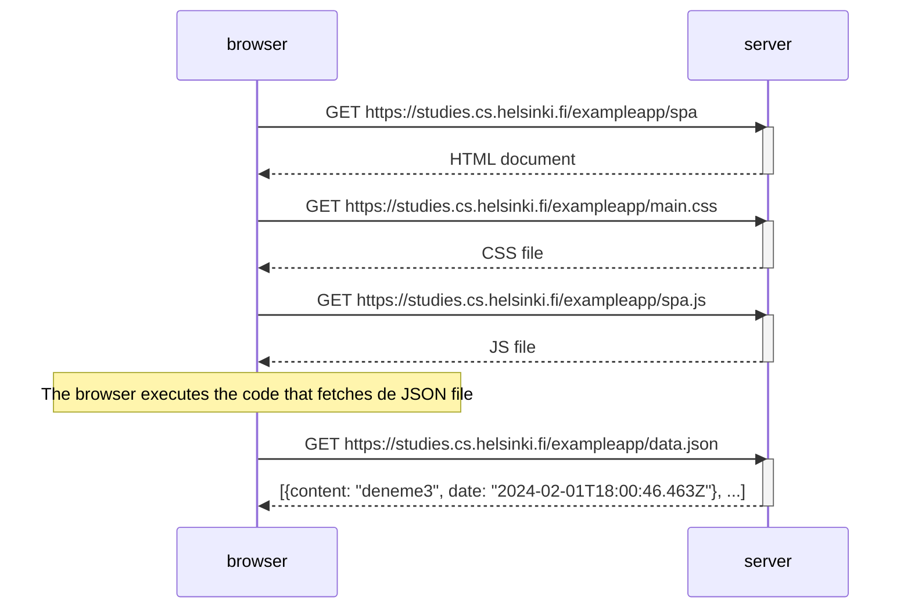

```mermaid
sequenceDiagram
  participant browser
  participant server

  browser ->> server: GET https://studies.cs.helsinki.fi/exampleapp/spa
  activate server
  server -->> browser: HTML document
  deactivate server

  browser ->> server: GET https://studies.cs.helsinki.fi/exampleapp/main.css
  activate server
  server -->> browser: CSS file
  deactivate server

  browser ->> server: GET https://studies.cs.helsinki.fi/exampleapp/spa.js
  activate server
  server -->> browser: JS file
  deactivate server

  Note over browser: The browser executes the code that fetches de JSON file

  browser ->> server: GET https://studies.cs.helsinki.fi/exampleapp/data.json
  activate server
  server -->> browser: [{content: "deneme3", date: "2024-02-01T18:00:46.463Z"}, ...]
  deactivate server
```
